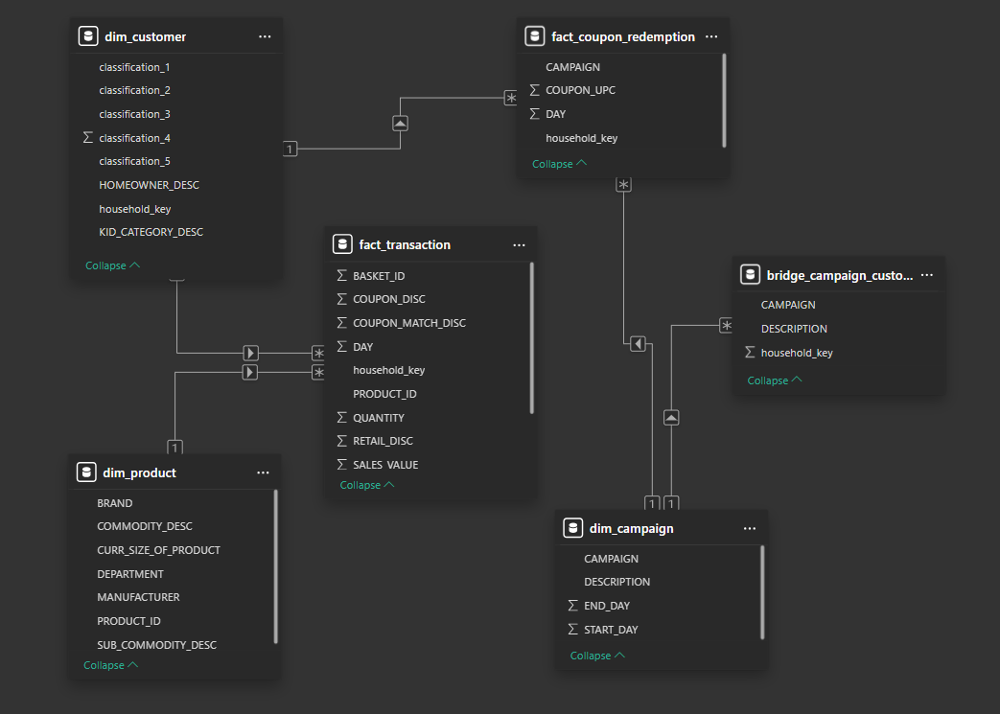
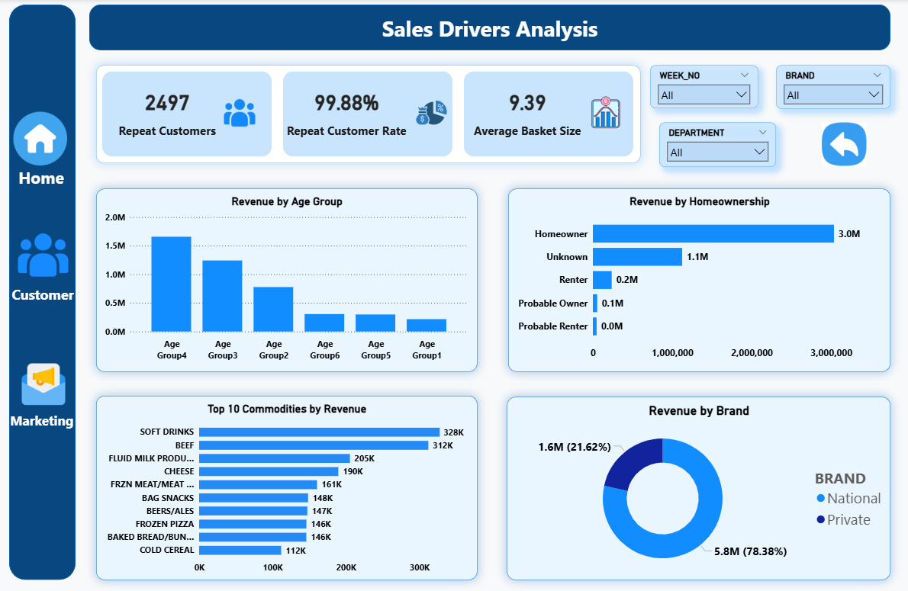
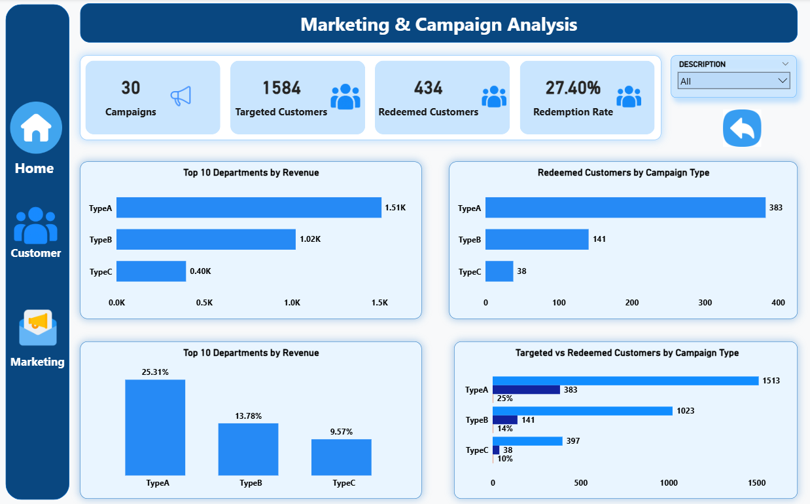

# Retail Sales Performance Analysis

An end-to-end retail data analytics project using **PostgreSQL, SQL, Power BI, and DAX** to analyze sales performance, customer behavior, product performance, and marketing campaign effectiveness.

---

## 📌 Project Overview

This project analyzes retail transaction data to understand the key factors affecting sales and customer behavior.

The project covers the complete analytics workflow—from data profiling and cleaning to SQL analysis, data modeling, DAX calculations, and interactive Power BI dashboard development.

The final dashboard provides a consolidated view of **sales, customers, products, brands, and marketing campaigns**.

---

## 🎯 Business Objectives

The main objectives of this project are to:

- Understand overall sales performance
- Identify major revenue drivers
- Analyze customer purchasing behavior
- Identify high-value and repeat customers
- Compare product and brand performance
- Evaluate campaign reach and redemption
- Support data-driven business decisions

---

## 🗂️ Dataset

The dataset contains retail transaction data along with customer, product, and campaign information.

### Main Tables

| Table | Purpose |
|---|---|
| `fact_transaction` | Transaction and sales data |
| `dim_customer` | Customer information |
| `dim_product` | Product information |
| `dim_campaign` | Campaign information |
| `bridge_campaign_customer` | Links customers with campaigns |
| `fact_coupon_redemption` | Coupon redemption records |

The data is organized using **fact, dimension, and bridge tables** to support analytical reporting.

---

## 🛠️ Tools & Technologies

- **Excel** — Initial data inspection and profiling
- **PostgreSQL / SQL** — Data validation and business analysis
- **Power BI** — Data modeling, visualization, and dashboard development
- **DAX** — KPI and business measure creation
- **Git & GitHub** — Project version control and documentation

---

## 🧩 Data Model

The Power BI data model uses a combination of **fact, dimension, and bridge tables** to support sales, customer, product, and campaign analysis.

### Model Structure

| Table | Type | Purpose |
|---|---|---|
| `fact_transaction` | Fact | Transaction and sales data |
| `dim_customer` | Dimension | Customer information |
| `dim_product` | Dimension | Product information |
| `dim_campaign` | Dimension | Campaign information |
| `bridge_campaign_customer` | Bridge | Links customers with campaigns |
| `fact_coupon_redemption` | Fact | Coupon redemption records |

### Model Design

The model was designed to maintain clear relationships between transactional data and descriptive dimensions while supporting interactive filtering and KPI calculations in Power BI.

### Data Model Preview

<p align="center">
  
</p>

---


## 📊 Key KPIs

The dashboard tracks the following key metrics:

- **Total Revenue**
- **Total Orders**
- **Total Customers**
- **Average Order Value**
- **Repeat Customers**
- **Repeat Customer Rate**
- **Average Basket Size**
- **Targeted Customers**
- **Redeemed Customers**
- **Redemption Rate**

---

## 📊 Dashboard Preview

The Power BI dashboard consists of three analytical pages.

### 1. Executive Overview

 

Provides a high-level view of sales performance.

**Includes:**

- Total Revenue
- Total Orders
- Total Customers
- Average Order Value
- Monthly Revenue Trend
- Monthly Orders Trend
- Top 10 Departments
- Top 10 Products

### 2. Sales Drivers Analysis



Focuses on customer behavior and the main drivers of sales.

**Includes:**

- Repeat Customers
- Repeat Customer Rate
- Average Basket Size
- Revenue by Age Group
- Top 10 Customers by Revenue
- Top 10 Commodities
- Revenue by Brand

### 3. Marketing & Campaign Analysis



Focuses on campaign reach and customer response.

**Includes:**

- Targeted Customers
- Redeemed Customers
- Redemption Rate
- Campaign Reach
- Redeemed Customers by Campaign Type
- Campaign Redemption Rate
- Targeted vs. Redeemed Customers

---

## 💡 Key Business Insights

### Sales Performance

Sales trends help identify periods of stronger or weaker revenue and order performance.

### Product Performance

High-performing products and departments account for a significant share of total sales, indicating that revenue is concentrated among a smaller group of products.

### Customer Behavior

Repeat purchasing and customer-level revenue analysis help identify valuable customers and highlight opportunities for customer retention.

### Brand Performance

Comparing National and Private brands provides a clearer view of their contribution to revenue and customer purchasing patterns.

### Campaign Performance

Campaign targeting and coupon redemption analysis provides a view of customer reach and campaign response.

---

## 💼 Business Recommendations

Based on the analysis:

### 1. Focus on High-Performing Products

Maintain strong availability and promotional focus on products and departments that contribute significantly to revenue.

### 2. Improve Customer Retention

Identify high-value and repeat customers and consider targeted retention offers.

### 3. Review Campaign Effectiveness

Compare campaign types based on targeting and redemption performance and prioritize stronger-performing campaigns.

### 4. Monitor Brand Performance

Track National and Private brand performance to identify changing customer preferences and growth opportunities.

---

## 🔄 Project Workflow

```text
Data Profiling
      ↓
Data Cleaning & Validation
      ↓
SQL Analysis
      ↓
Data Modeling
      ↓
DAX Measures
      ↓
Power BI Dashboard
      ↓
Business Insights
      ↓
Recommendations
```

---

## 📁 Project Structure

```text
Retail-Sales-Performance-Analysis/
│
│
├── Docs/
│   ├── Project_Charter.pdf
│   ├── Data_Profiling_and_Cleaning_Report.pdf
│   ├── Data_Model_and_DAX_Documentation.pdf
│   └──_Dashboard_and_Business_Insights_Report.pdf
│
├── SQL/
│   └── campaign_analysis.sql
│   └── customer_analysis.sql
│   └── fact_transaction.sql
│   └── product_analysis.sql
│
├── PowerBI/
│   └── retail_mart.pbix
│
└── README.md
```

---

## 📚 Project Documentation

Detailed project documentation is available in the `Documentation` folder:

1. **Project Charter**  
   Project background, objectives, scope, and business questions.

2. **Data Profiling & Cleaning Report**  
   Dataset overview, data quality checks, and cleaning actions.

3. **Data Model & DAX Documentation**  
   Table roles, grain, relationships, and key DAX measures.

4. **Dashboard & Business Insights Report**  
   Dashboard structure, insights, recommendations, and business value.

---

## 🎯 Business Value

The dashboard provides a single view of key sales, customer, product, and campaign metrics.

It helps users:

- Monitor sales performance
- Identify important revenue drivers
- Understand customer behavior
- Evaluate product and brand performance
- Compare campaign effectiveness
- Support data-driven decisions

---

## 🚀 Project Outcome

The final outcome is an interactive **Power BI Retail Sales Performance Dashboard** supported by SQL analysis, a structured data model, and business-focused DAX measures.

The project demonstrates an end-to-end approach to transforming raw retail data into meaningful business insights.

---

## 👨‍💻 Author

**Shahadat Hossain Sajim**  
Data Analyst | Retail & E-Commerce

- 🔗 **GitHub:** [SH-SAJIM](https://github.com/SH-SAJIM)
- 💼 **LinkedIn:** [Shahadat Hossain Sajim](https://www.linkedin.com/in/shahadat-hossain-sajim/)

**Skills:** PostgreSQL • SQL • Power BI • DAX • Excel  • Git • GitHub